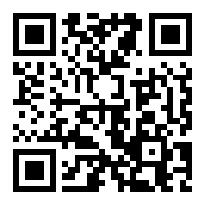
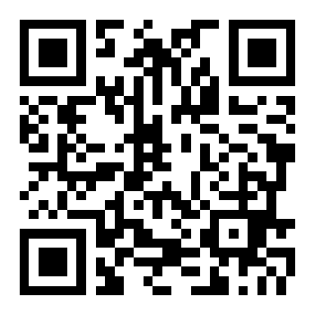
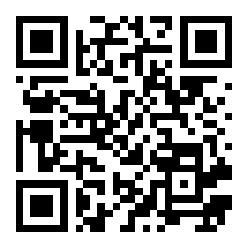

# 📱 คู่มือการทดสอบ Core Flow บนมือถือจริง (Mobile Pilot Testing Guide)
## โครงการ RAN-R-HAN — สถาปัตยกรรมระบบร้านอาหารและไรเดอร์แบบครบวงจร

> **เอกสารนี้คือ Go/No-Go Gate Checklist** สำหรับทีมงานและเจ้าของร้าน เพื่อใช้ทดสอบการทำงานของระบบทุกส่วนบนสมาร์ตโฟนเครื่องจริง (Android และ iPhone) ก่อนเปิดให้บริการ Pilot แก่ลูกค้าทั่วไป  
> 📄 **ดาวน์โหลดไฟล์ Word (.docx) สำหรับพิมพ์หรือเปิดบนมือถือ:** [`docs/คู่มือทดสอบภาคสนาม_Core_Flow_มือถือจริง.docx`](./คู่มือทดสอบภาคสนาม_Core_Flow_มือถือจริง.docx) (หรือ [`docs/mobile-field-test-guide.docx`](./mobile-field-test-guide.docx))

> [!NOTE]
> **สิ่งที่ผ่านการตรวจแล้วในระบบจำลอง (Simulation):** Backend DB, PostGIS Queries, Cron 200 OK, Auth/Work Session RPCs  
> **สิ่งที่ต้องนำมือถือออกไปทำจริงในพื้นที่ อ.เมือง แม่ฮ่องสอน รอบเดียว (Gate 6 Physical E2E):**
> 1. ติดตั้ง PWA บนหน้าจอหลัก (Home Screen) ของ Android (Chrome) และ iPhone (Safari)
> 2. ทดสอบ Background GPS เคลื่อนที่จริงขณะขับขี่ยานพาหนะสู่ร้านครัวป้าแดง
> 3. ทดสอบการชำระเงินโอนจริงด้วย PromptPay และแนบสลิปผ่าน SlipOK
> 4. ทดสอบ Web Push และการสั่นเตือน (Vibration) เมื่อมี Offer งานใหม่เด้งเข้ามือถือไรเดอร์
> 5. ทดสอบเปิดกล้องถ่ายภาพจริงและอัปโหลดส่งมอบอาหาร (POD) ถึงบ้านลูกค้า
> 6. ทดสอบสรุปยอดเงิน Settlement และปิดกะงานเพื่อตรวจสอบการลบพิกัดตามกฎหมาย PDPA

---

## 🎯 วัตถุประสงค์การทดสอบ
ทดสอบการทำงานเชื่อมโยงกันแบบไร้รอยต่อของ 7 ระบบหลัก (Core Lifecycle):
1. **Order** — ลูกค้าสั่งอาหาร Delivery ระบุตำแหน่งพิกัด GPS บนแผนที่
2. **Payment** — ตรวจสอบสลิปโอนเงิน PromptPay จริงผ่านระบบ SlipOK
3. **KDS** — ครัวรับออเดอร์ เปลี่ยนสถานะกำลังปรุง และปรุงเสร็จ
4. **Dispatch** — อัลกอริทึมจับคู่และยิง Offer อัตโนมัติให้ไรเดอร์ที่ใกล้ที่สุด
5. **Rider** — ไรเดอร์รับงานผ่าน PWA ยืนยันรับอาหาร และเดินทางนำส่ง
6. **POD (Proof of Delivery)** — ถ่ายภาพกล้องจริงเพื่อยืนยันการส่งมอบอาหารสำเร็จ
7. **Settlement** — สรุปยอดรายได้ค่ารอบไรเดอร์ และล้างพิกัดตามนโยบาย PDPA

---

## 🔐 ข้อมูลตั้งต้นและบัญชีทดสอบ (Production Credentials)

### 🏪 ร้านค้าทดลอง (Pilot Shop)
- **ร้านค้า:** ครัวป้าแดง อาหารตามสั่ง (`krua-pa-daeng`)
- **URL ลูกค้า:** `https://ran-r-han.vercel.app/krua-pa-daeng`
- **URL ครัว (KDS):** `https://ran-r-han.vercel.app/admin/orders`
- **PIN สำหรับเข้า KDS:** `0000`
- **พิกัดร้าน:** `19.3005, 97.9678` (เทศบาลเมืองแม่ฮ่องสอน)
- **PromptPay บัญชีร้าน:** `0615125679` (ธนัชชา ศรีมณี)

### 🛵 บัญชีไรเดอร์ทดลอง (Pilot Riders)
- **URL ไรเดอร์ PWA:** `https://ran-r-han.vercel.app/rider`
- **ไรเดอร์คนที่ 1:**
  - อีเมล: `rider1.kruapa@gmail.com`
  - รหัสผ่าน: `<ดูจาก .env.local ตัวแปร PILOT_RIDER_PASSWORD>`
  - ชื่อแสดงผล: สมชาย ขี่เร็ว (เบอร์โทร: `089-111-2233`)
- **ไรเดอร์คนที่ 2:**
  - อีเมล: `rider2.kruapa@gmail.com`
  - รหัสผ่าน: `<ดูจาก .env.local ตัวแปร PILOT_RIDER_PASSWORD>`
  - ชื่อแสดงผล: วิชัย บริการดี (เบอร์โทร: `089-444-5566`)

### 📲 QR Code สำหรับสแกนเข้าใช้งานบนมือถือทันที

| 1. ไรเดอร์ PWA (`/rider`) | 2. ลูกค้าสั่ง Delivery (`/krua-pa-daeng`) | 3. ครัว KDS (`/admin/orders`) |
|:---:|:---:|:---:|
|  |  |  |
| สแกนด้วย **มือถือไรเดอร์** | สแกนด้วย **มือถือลูกค้า** | สแกนด้วย **แท็บเล็ต/คอมครัว** (PIN: `0000`) |

---

## 🚀 ลำดับขั้นตอนการทดสอบอย่างละเอียด (7-Step Core Flow)

```
[ขั้นตอนที่ 1] ไรเดอร์เตรียมความพร้อม ➔ เปิดกะ Online + ขอสิทธิ์ GPS
       │
[ขั้นตอนที่ 2] ลูกค้าสั่งอาหาร Delivery ➔ ปักหมุดที่อยู่จัดส่ง
       │
[ขั้นตอนที่ 3] ชำระเงินจริง ➔ โอน PromptPay + อัปโหลดสลิป SlipOK
       │
[ขั้นตอนที่ 4] ครัวรับออเดอร์ใน KDS ➔ ปรุงอาหาร ➔ กดพร้อมส่ง
       │
[ขั้นตอนที่ 5] ระบบ Auto-Dispatch ➔ ยิง Offer เข้าไรเดอร์ ➔ กดรับงาน
       │
[ขั้นตอนที่ 6] ไรเดอร์รับอาหาร ➔ เดินทาง ➔ ถ่ายรูปส่งมอบ (POD)
       │
[ขั้นตอนที่ 7] ส่งมอบสำเร็จ ➔ สรุปยอดเงิน Settlement ➔ ปิดกะ PDPA
```

---

### ขั้นตอนที่ 1: เตรียมไรเดอร์ให้พร้อมรับงาน (Rider Standby)
1. หยิบมือถือที่จะใช้เป็น **เครื่องไรเดอร์** เปิดเบราว์เซอร์ไปที่:
   👉 `https://ran-r-han.vercel.app/rider`
2. ระบบจะพาไปยังหน้า `/rider/login` ให้กรอก:
   - Email: `rider1.kruapa@gmail.com`
   - Password: `<ดูจาก .env.local ตัวแปร PILOT_RIDER_PASSWORD>`
3. กดยอมรับการเข้าถึงตำแหน่งพิกัด (**Allow Geolocation / While using the app**)
4. กดปุ่มสีเขียว **"เปิดรับงาน (Start Work Session)"**
5. **สิ่งที่ต้องตรวจสอบ:**
   - [ ] หน้าจอขึ้นสถานะสีเขียว "กำลังเปิดรับงาน (Online)"
   - [ ] มีการอัปเดตพิกัด GPS แสดงบนหน้าจอ

---

### ขั้นตอนที่ 2: ลูกค้าสร้างออเดอร์ Delivery (Customer Order)
1. หยิบมือถืออีกเครื่องที่จะใช้เป็น **เครื่องลูกค้า** เปิดเบราว์เซอร์ไปที่:
   👉 `https://ran-r-han.vercel.app/krua-pa-daeng`
2. เลือกรูปแบบการรับประทาน: เลือกแท็บ **"Delivery (จัดส่ง)"**
3. ปักหมุดตำแหน่งที่อยู่จัดส่ง หรือกดยืนยันตำแหน่งปัจจุบันของลูกค้า
4. ระบุรายละเอียดที่อยู่เพิ่มเติม (เช่น ชื่ออาคาร, ห้อง, ซอย)
5. กรอก **ชื่อลูกค้า** และ **เบอร์โทรศัพท์**
6. เลือกเมนูอาหาร (เช่น กะเพราหมูกรอบ, ข้าวผัด ฯลฯ) ใส่ลงตะกร้า
7. กด **"สรุปรายการสั่งซื้อ"** และตรวจสอบยอดรวม (ค่าอาหาร + ค่าจัดส่ง)
8. กด **"ยืนยันการสั่งซื้อ"**
9. **สิ่งที่ต้องตรวจสอบ:**
   - [ ] ออเดอร์ถูกสร้างและพามาหน้าชำระเงิน
   - [ ] มี QR Code PromptPay ปรากฏขึ้นพร้อมยอดเงินที่ถูกต้อง

---

### ขั้นตอนที่ 3: ชำระเงินและตรวจสอบสลิปจริง (SlipOK Verification)
1. เปิดแอปธนาคารบนมือถือ สแกน QR Code หรือโอนเงินเข้าบัญชี PromptPay:
   - หมายเลข: `0615125679` (ธนัชชา ศรีมณี)
   - จำนวนเงิน: โอนตามยอดที่แสดงในหน้าสั่งซื้อ
2. บันทึกรูปภาพสลิปการโอนเงินเก็บไว้ในเครื่อง
3. ในหน้าเว็บสั่งซื้อ RAN-R-HAN กดปุ่ม **"แนบสลิป / อัปโหลดสลิป"**
4. เลือกไฟล์รูปภาพสลิปที่เพิ่งบันทึก
5. **สิ่งที่ต้องตรวจสอบ:**
   - [ ] ระบบ SlipOK ทำการตรวจสอบสลิปแบบเรียลไทม์
   - [ ] หน้าจอเปลี่ยนเป็น **"ชำระเงินสำเร็จ (Verified)"** ทันที
   - [ ] สถานะออเดอร์เปลี่ยนเป็น **"ยืนยันแล้ว (Confirmed)"**
   - [ ] *(หากเชื่อมต่อ Telegram Bot จะมีข้อความแจ้งเตือนเข้า Telegram)*

---

### ขั้นตอนที่ 4: ครัวรับออเดอร์และปรุงอาหาร (KDS Flow)
1. เปิดหน้า KDS บนแท็บเล็ต/มือถือร้าน/คอมพิวเตอร์:
   👉 `https://ran-r-han.vercel.app/admin/orders` (ใส่ PIN: `0000`)
2. ในคอลัมน์ **"รอปรุง (Pending)"** จะมีบัตรออเดอร์ใหม่ปรากฏขึ้นพร้อมเสียงเตือน
3. พ่อครัวกดปุ่ม **"กำลังปรุง (Cooking)"** ➔ บัตรย้ายไปคอลัมน์กำลังปรุง
4. เมื่อทำอาหารเสร็จ กดปุ่ม **"ปรุงเสร็จแล้ว / พร้อมส่ง (Ready for Delivery)"**
5. **สิ่งที่ต้องตรวจสอบ:**
   - [ ] บัตรออเดอร์เปลี่ยนสถานะเป็นพร้อมส่ง
   - [ ] ระบบหลังบ้านเริ่มจับคู่ไรเดอร์อัตโนมัติ (Trigger Auto-Dispatch)

---

### ขั้นตอนที่ 5: ไรเดอร์รับ Offer งานใหม่ (Dispatch & Accept)
1. ดูที่หน้าจอมือถือไรเดอร์ (`/rider`)
2. จะมีหน้าต่าง Pop-up หรือ Card แจ้งเตือน: **"มีงานใหม่เข้ามา!"**
   - แสดงเวลานับถอยหลัง (30 วินาที)
   - แสดงระยะทางจากร้านไปบ้านลูกค้า
   - แสดงรายได้ค่ารอบ (Earning) ที่จะได้รับ
3. ไรเดอร์กดปุ่ม **"รับงาน (Accept Offer)"**
4. **สิ่งที่ต้องตรวจสอบ:**
   - [ ] หน้าจอเปลี่ยนเป็นหน้ารายละเอียดงาน "กำลังไปรับอาหารที่ร้าน"
   - [ ] แสดงปุ่มนำทาง (Navigation/Map) ไปยังร้านครัวป้าแดง

---

### ขั้นตอนที่ 6: รับอาหาร นำส่ง และถ่ายรูปส่งมอบ (POD Camera Flow)
1. **เมื่อไรเดอร์ถึงร้าน:** ตรวจสอบความถูกต้องของอาหาร แล้วกด **"รับอาหารแล้ว (Picked Up)"**
   - สถานะออเดอร์ใน KDS และระบบลูกค้าจะเปลี่ยนเป็น "กำลังจัดส่ง (Delivering)"
2. **เมื่อไรเดอร์เดินทางถึงลูกค้า:**
   - กดปุ่ม **"ส่งมอบอาหาร (Complete Delivery)"**
   - หน้าจอจะเปิดกล้องของมือถือขึ้นมา ให้ถ่ายภาพอาหารส่งมอบให้ลูกค้าหรือวางไว้ที่จุดรับ (POD)
   - กด **"ยืนยันการจัดส่งพร้อมรูปถ่าย"**
3. **สิ่งที่ต้องตรวจสอบ:**
   - [ ] รูปภาพ POD ถูกอัปโหลดขึ้น Cloud Storage อย่างสมบูรณ์
   - [ ] หน้าจอลูกค้าและ KDS อัปเดตสถานะเป็น **"จัดส่งสำเร็จ (Completed)"**

---

### ขั้นตอนที่ 7: ตรวจสอบยอดเงินและการปิดกะ (Settlement & PDPA)
1. **ฝั่งไรเดอร์:** ในหน้า `/rider` ดูที่แท็บสรุปรายได้
   - [ ] ตรวจสอบว่ามียอดเงินค่ารอบเพิ่มขึ้นในประวัติรายได้วันนี้
   - [ ] กดปุ่มสีแดง **"ปิดกะทำงาน (Close Work Session)"**
2. **การปฏิบัติตาม PDPA (ความปลอดภัยข้อมูลส่วนบุคคล):**
   - เมื่อกดปิดกะ ข้อมูลพิกัดสดของไรเดอร์ (`rider_current_locations`) จะถูกลบออกจากระบบทันที ไม่มีการติดตามพิกัดนอกเวลางาน

---

## 📊 ตารางบันทึกผลการทดสอบแยกตามอุปกรณ์ (Device Verification Matrix)

| รายการทดสอบ | ฝั่ง Android (Chrome) | ฝั่ง iPhone (Safari) | ผลลัพธ์ที่คาดหวัง | ผ่าน / ไม่ผ่าน |
|---|---|---|---|:---:|
| **1. หน้าเมนูลูกค้า** | เปิดเว็บเบราว์เซอร์ | เปิด Safari | โหลดเร็ว สวยงาม ปุ่มกดตอบสนองดี | [ ] |
| **2. Geolocation ปักหมุด** | ขอสิทธิ์ "While using app" | ขอสิทธิ์ "Allow Once / While using" | ดึงพิกัด GPS แม่นยำ | [ ] |
| **3. สแกนจ่าย & สลิป** | โอนจริง + อัปโหลดรูปสลิป | โอนจริง + อัปโหลดจาก Photos | SlipOK ตรวจสอบผ่านใน 3 วินาที | [ ] |
| **4. เสียงเตือน KDS** | ลำโพงเครื่องดังเตือน | เสียงเตือนทำงานปกติ | ครัวรู้ทันทีเมื่อมีออเดอร์ใหม่ | [ ] |
| **5. Offer ไรเดอร์** | เด้ง Offer พร้อมนับถอยหลัง | เด้ง Offer พร้อมนับถอยหลัง | ข้อมูลระยะทางและค่ารอบถูกต้อง | [ ] |
| **6. ถ่ายรูป POD (กล้อง)** | เปิดกล้องหลังอัตโนมัติ | Safari ขออนุญาตกล้อง + ถ่ายรูป | รูปชัดเจน ไม่หมุนกลับด้าน | [ ] |
| **7. สรุปเงิน Settlement** | ยอดเงินขึ้นตรง | ยอดเงินขึ้นตรง | ไรเดอร์เห็นยอดค่ารอบสะสมถูกต้อง | [ ] |

---

## 🛠️ วิธีแก้ปัญหาเฉพาะหน้า (Troubleshooting Guide)

| อาการที่พบ | สาเหตุที่เป็นไปได้ | แนวทางแก้ไข |
|---|---|---|
| **ไม่ขึ้นตัวเลือก Delivery** | ร้านไม่ได้เปิดระบบจัดส่ง | ตัวเลือกระบบได้ถูกเปิดใช้งานแล้ว หากยังไม่เห็นให้รีเฟรชหน้าเว็บ |
| **สลิปไม่ผ่าน / ตรวจไม่พบ** | สลิปซ้ำ หรือโอนยอดไม่ตรง | ตรวจสอบว่ายอดโอนตรงกับยอดรวม และเป็นสลิปใหม่ที่ไม่เคยใช้ในระบบ |
| **ไรเดอร์ไม่ได้รับ Offer** | ไรเดอร์ไม่ได้กด "เปิดรับงาน" หรือปิด GPS | ตรวจสอบว่ากดปุ่มสีเขียว "เปิดรับงาน" และอนุญาตสิทธิ์ Location ในเบราว์เซอร์แล้ว |
| **Offer หมดเวลาก่อนกด** | พ้นกำหนดเวลา 30 วินาที | External Cron จะหมุนออเดอร์กลับไป pending เพื่อยิงหาไรเดอร์ใหม่อัตโนมัติ |
| **กล้องไม่เปิดตอนถ่ายรูป POD** | เบราว์เซอร์ยังไม่ได้รับอนุญาต Camera | เข้าไปที่การตั้งค่าเบราว์เซอร์ (Settings ➔ Site Settings ➔ Camera) แล้วกด Allow |
